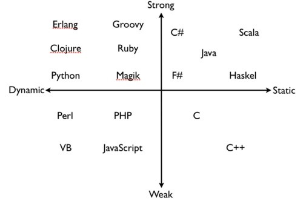
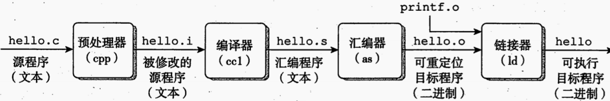
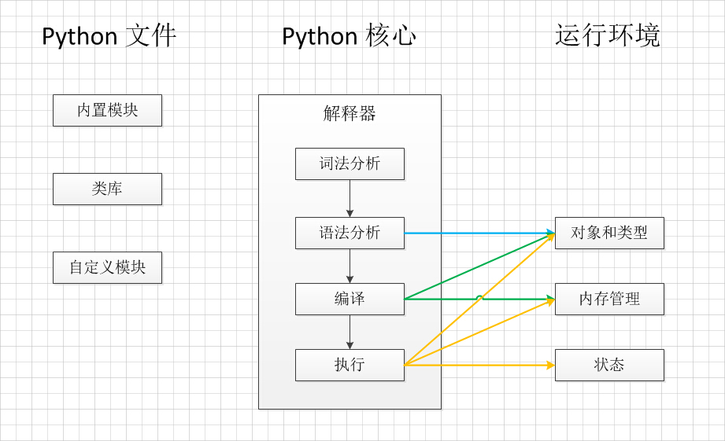

<!-- $size: 4:3 -->
# Topic 高级语言的特点描述

---

---

---

## 三个问题

1. 什么是高级语言，为什么设计语言，他们的精妙之处。
2. 如何分类高级语言
3. 这些如何和计算机交互，每种语言的擅长之处。
---
# Episode 1
## 高级语言的定义、发展史、设计者初衷
---
## 第一次伟大尝试

* *Konrad Zuse* 尝试构建 *Plankalkül* 

* *Z1*计算机

---

## 成功的尝试

* *John Backus*领导团队开发了*FORTRAN*语言
* *Grace Hopper*。她设计了*FLOW-MATIC*语言
* *CODASYL* 设计了 *COBOL* 

	

---

## 新的算法语言 ALGOL

* 嵌套块结构
* 词汇作用域
* **BNF**

---

## 程序世界的寒武纪
* 一些语言
	* **Speakeasy**、**Simula**、**C**、**Smalltalk**、**Prolog**、**ML** 
* 一些范式
	* OOPS、OOP、FP、Programming in Logic

---

## 和平发展

* c++、Ada、*第五代编程语言* 、便准化**ML** **LISP**
* 分布式
* **RISC**运动

---

## 新时代的蓬勃发展

* RAD（rapid application development）
* 生产力

---

## 可预见的未来

可视化编程、数据库集成、开源语言

---

# episode 2
## 分类方式

---

### 第一种分类方式

| 语言 | 编译型语言 | 解释型语言 |
| -- | -- | -- |
| 优点 | 编译和执行分开，效率高 | 平台兼容性好，修改代码灵活，不需要停机维护 |
| 缺点 | 平台移植麻烦 | 性能差、捕捉编译错误差 |

---

### 第二种分类方式

---

# episode 3
## 语言和计算机交互
## 每种语言的擅长之处
## 和为什么擅长

---

## 编译型语言

###### 著名的C语言编译过程

---

## 解释型

python 源文件被翻译为字节码，然后用PVM执行。

---

## 混合型

|过程|输入|输出|
|--|--|--|
|词法分析|Java字符流|记号|
|语法分析|记号流|语法树|
|语义分析|语法树|注释抽象语法树|
|字节码生成器|抽象语法树|字节码|

字节码最终在JVM上执行

--- 

