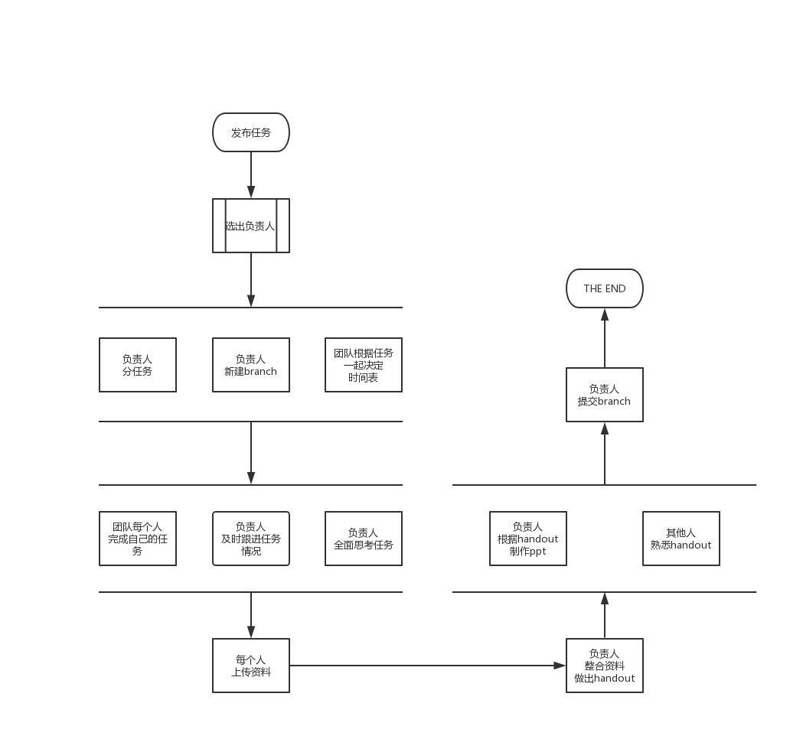

# 大三上小班课

## 成员

石渊友、冯杨洋、冯蒙悦、金洁茜、李昂

## 项目意义

这次小班课的所有都借助Github平台统一托管。便于整理和跨平台。

## 时间表

| 周次 | 时间  | 科目 |            题目/主题             |                       负责人                       |
| :--: | :---: | :--: | :------------------------------: | :------------------------------------------------: |
|  5   | 10.7  |  cp  |             [词法分析](https://github.com/master2vic/Junior/CP/1.词法分析)             |   [@SHI Yuanyou](https://github.com/master2vic)    |
|  6   | 10.16 |  os  |       操作系统设计相关⼯具       |     [@mengyueFeng](https://github.com/gru111)      |
|  6   | 10.16 |  ai  |        AIMA Chapters 1-3         |    [@CynricFeng](https://github.com/CynricFeng)    |
|  7   | 10.21 |  cp  |             语法分析             |       [@jjxsxxn](https://github.com/jjxsxxn)       |
|  8   | 10.30 |  os  |    使用系统调用编写用户态程序    | [@LIANG-star177](https://github.com/LIANG-star177) |
|  8   | 10.30 |  ai  |        AIMA Chapters 5-8         |     [@mengyueFeng](https://github.com/gru111)      |
|  10  | 11.13 |  os  | 商用操作系统和开源操作系统的讨论 |    [@CynricFeng](https://github.com/CynricFeng)    |
|  10  | 11.13 |  ai  |  AIMA Chapter 9 & 13 & 14 18-21  |       [@jjxsxxn](https://github.com/jjxsxxn)       |
|  11  | 11.18 |  cp  |      语义分析和中间代码生成      |    [@CynricFeng](https://github.com/CynricFeng)    |
|  12  | 11.27 |  os  |    操作系统设计的⾼级主题讨论    |   [@SHI Yuanyou](https://github.com/master2vic)    |
|  12  | 11.27 |  ai  |     人工智能算法及其应用研讨     | [@LIANG-star177](https://github.com/LIANG-star177) |
|  13  | 12.2  |  cp  |     运行时环境和目标代码生成     |     [@mengyueFeng](https://github.com/gru111)      |

*备注： 具体题目可能会根据具体情况修改，每次负责人修改相关主题，添加超链接到具体的主项目的文件夹。*

## 操作流程

## 文件说明

### 1. PPT

这里的PPT是使用Marp工具，并利用markdown这种纯文本格式的标记语言来完成。

关于Marp的参考于下载：https://yhatt.github.io/marp/

注意：Markdown语言的一大部分编辑器中可以解析html，Marp也同样可以做到。*请利用html来灵活的设计页面*。

### 2. Reading list

Reading list 中会包含老师建议小班课的预备阅读材料，和准备小班过程中使用到的阅读材料。**在小班的准备过程中一定要认真阅读相关材料。**

### 3.handout

handout 是讲义，是为了更好地制作PPT。是对团队上传材料的一次重组织。

### 4.src code

源代码的可阅读性要高。

## 注意事项

***强烈建议***：`完成环境为VScode` + `Github Desktop` + `git`

强烈禁止`Ctrl c` 和 `Ctrl v`,文献要自己总结和归纳。

**详情参考Sample文件夹**

> 引用文献网址：http://wenxian.aazz.cn