<!-- $size: 16:9 -->

ActivePointers: A Case for Software Address Translation on GPUs
===

*Sagi Shahar, Shai Bergman, Mark Silberstein*

---

# Problems

- **no I/O abstractions**
- no address space management
- no  page fault handling mechanisms
- not allow modifications to memory mappings for running GPU programs

---

# Motivation & Goals

**Build a software system:**

To overcome the limitations of the limitation GPU's hardware virtual memory.

- Memory mapped files
- One can build an encrypted file system for GPUs by installing custom page fault handlers for encrypt- ing/decrypting file contents on-the-fly
- Shared memory system in a cluster of GPUs

> The key element of our design is a new type of memory pointer we call *ActivePointer* *apointer*.

---

# Considerations & Challenges - From software

- **Main challenge: Low translation overhead.**
- **Efficient thread-level translation:** fast and convenient access, no deadlock when handling page fault.
- **Scalability.**

---

# Considerations & Challenges - From hardware

- **Coherence:** shared memory and L1 cache in each SM are not coherent, but stale mappings would result in page fault.
- **Asynchronous changes of page mappings.** 

> Constraining the ability of the paging system to revoke application access to a page at will is necessary to prevent asynchronous page mapping changes, eliminating the need for translation cache coherence.

---

# Design & Implementation - Principles

- **Active pages with fixed mapping.** 
  The page cannot be evicted from the page cache if it is being active used. Therefore each thread can cache the page mapping in its thread-private memory.
- **Keeping track of active pages.** 

---

# Design & Implementation - Active Pointers (apointers)

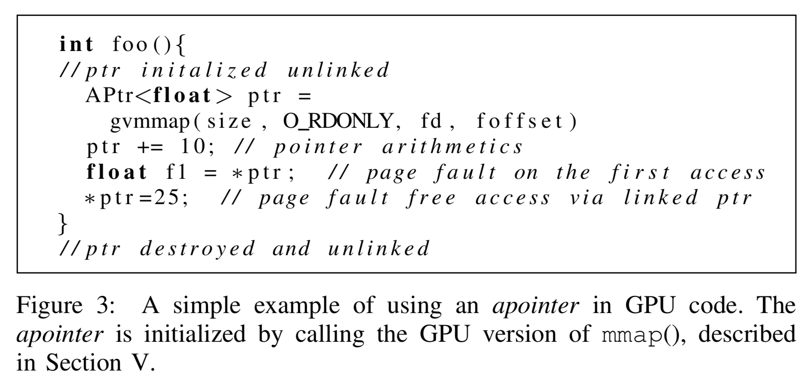

---

# Design & Implementation - Active Pointers (apointers)
## 3 states: uninitialized, unlinked or linked

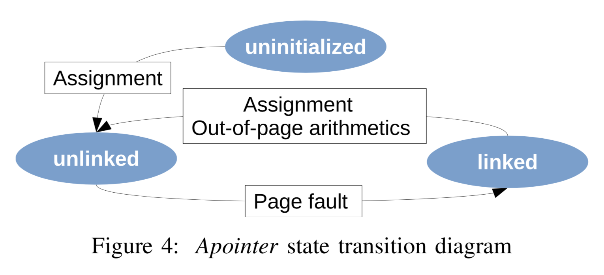

---
# Design & Implementation - Active Pointers (apointers)
## Reference count

**Reference count (in the page cache):** the number of linked *apointers* holding the reference to that page. 

- **Incremente:** the page transitions to the linked state
- **Decrement:** it becomes unlinked or it is destroyed outside the program scope

---

# Design & Implementation - Active Pointers (apointers)
## Data structure: translation field & metadata

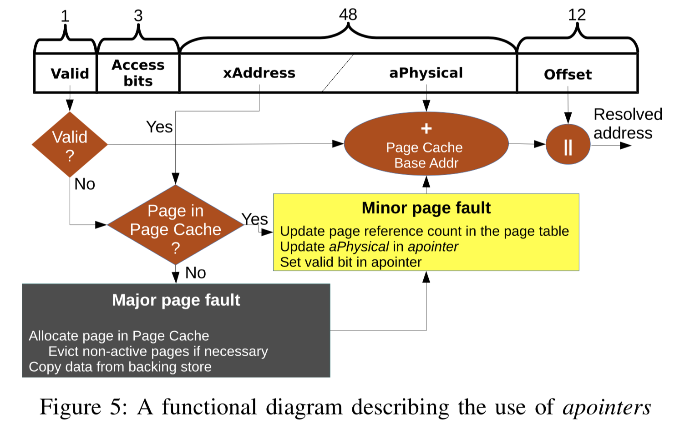

---

# Design & Implementation - Thread-level address translation
- **Design alternatives:**
  - a *short apointer*: an *aphysical* address and*x*Address
  - a *long apointer*: one of them
- **Optimizing performance via speculative prefetch.** 
- **Translation aggregation.**

---

# Design & Implementation - Thread-level address translation

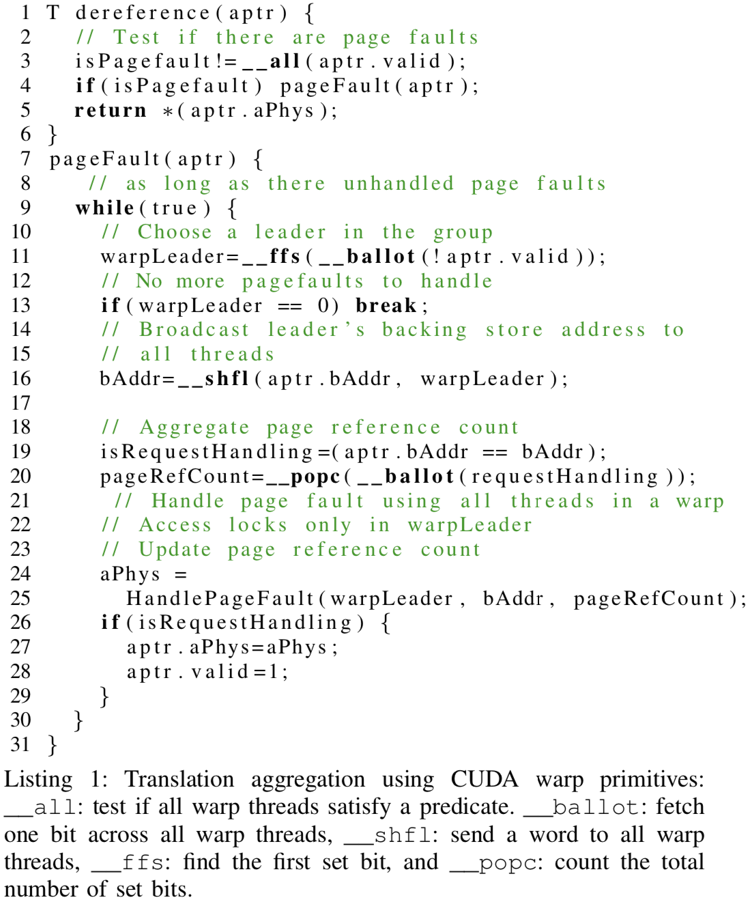

---

# Design & Implementation - Software TLB

- **Not necessary:** hardware registers hold the cache.
- Each threadblock maintains its own TLB for its threads.
- The TLB keeps the *threadblock-private* reference count for each cached page.

## Problems

- Count lost
- Deadlock
- Multiple TLBs ( global apointers )
- Overhead

---

# Evaluation & Analysis

- 2 X 6-core Intel i7-4960X CPUs at 3.6GHz, with 15MB L3/CPU, with power management and hyperthreading dis- abled for ensuring consistent results.
- A single GPU of the dual NVIDIA Tesla K80. 
- Ubuntu Linux kernel 3.13.0-32 with CUDA SDK 7.0 and NVIDIA GPU driver 346.59.
- All baseline implementations require fewer than 64 registers/thread and do not spill registers. 

---

# Evaluation & Analysis - Focus on

- Overhead of the software address translation layer on GPUs.
- The end-to-end performance of applications that use ActivePointers to map large datasets into GPU memory.

---

# Evaluation & Analysis - Apointer performance in page-fault free accesses
## Lantancy overhead

-  32 threads (one warp) where all the threads perform coalesced accesses to different offsets in one page. 
-  Each access involves a memory read and an increment operation.

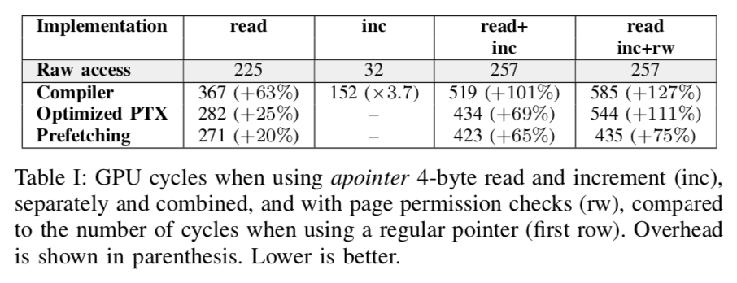

The most efficient apointer implementation uses 18 instructions vs. only 2 for a simple pointer increment.

---

# Evaluation & Analysis - Apointer performance in page-fault free accesses
## Throughput overhead

-  Run hundreds of warps to **saturate** all compute units in the mapped files and differs from the standard file system access pattern. 
-  Memory tiling

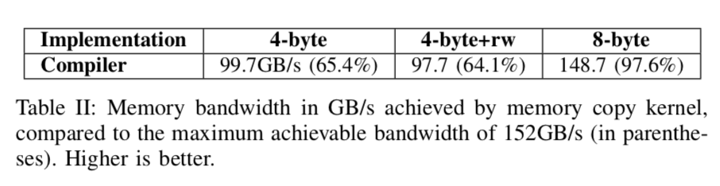

---

# Evaluation & Analysis - Apointer performance in page-fault free accesses
## Free- computation bubble
- NVIDIA K80 GPU issues $2056 \times 10^9$ **instructions** per second per GPU
- **Memory bandwidth:** $240 \times 10^9$ bytes/sec
- **Free-computation bubble:** 8.6 instructions per byte of memory traffic

---
# Evaluation & Analysis - Compute-intensive workloads
## 4-byte reads

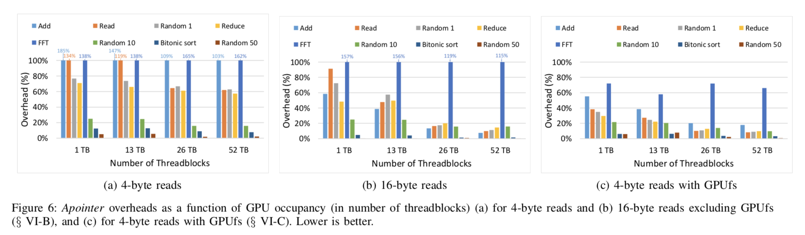

---
# Evaluation & Analysis - Page cache and apointers
## Page fault

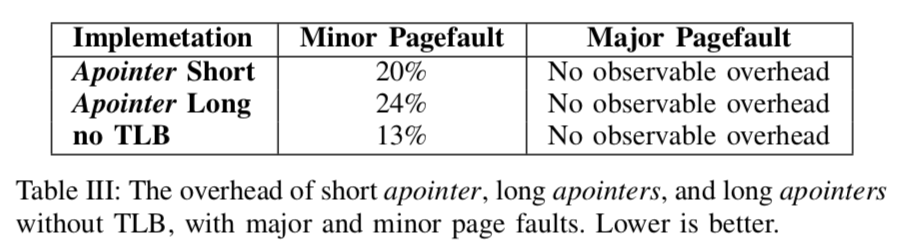

The best performance, however, is achieved without the TLB with long *apointer* because it avoids the overheads of TLB updates.

---
# Evaluation & Analysis - Page cache and apointers
## Effects of TLB size

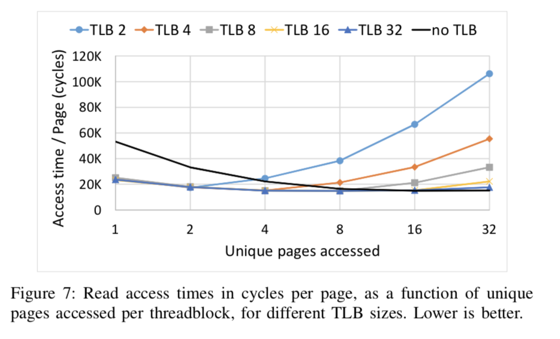

---
# Evaluation & Analysis - Compute-intensive workloads with page cache

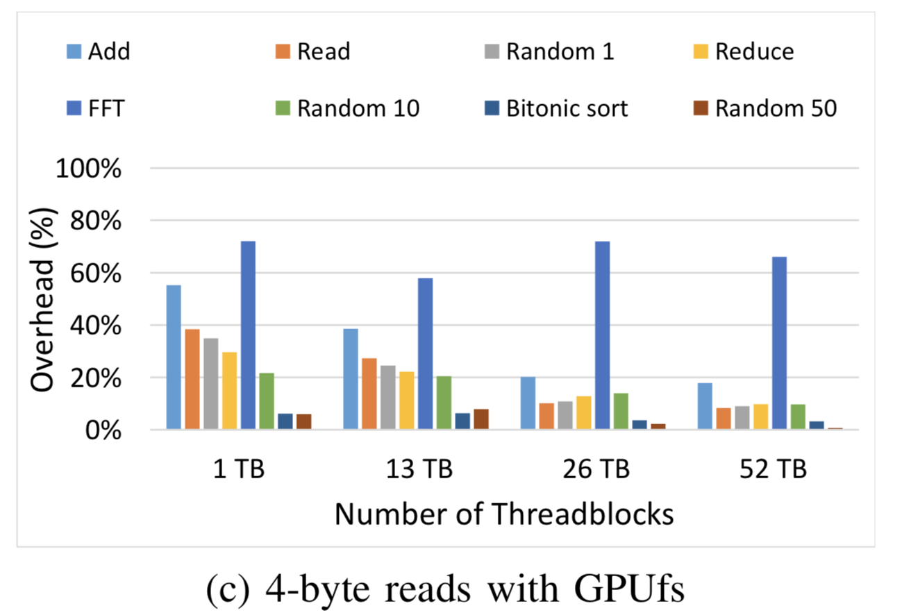

---
# Evaluation & Analysis - End-to-end application performance

The use of *apointers does not introduce any measurable overheads* over the fastest GPUfs-only im- plementation, and therefore achieves both high end-to-end performance and programming simplicity in this complex I/O-intensive application.

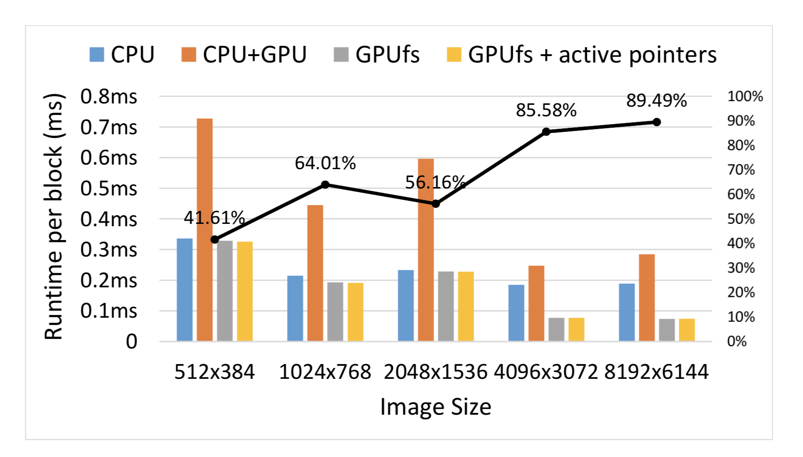

---
# Discussion
- Register pressure
- Compiler support
- Instructions for boundary checking and pointer increment
- I/O preemption

---
# The Last Word
- Page fault is available since Pascal
- DMA